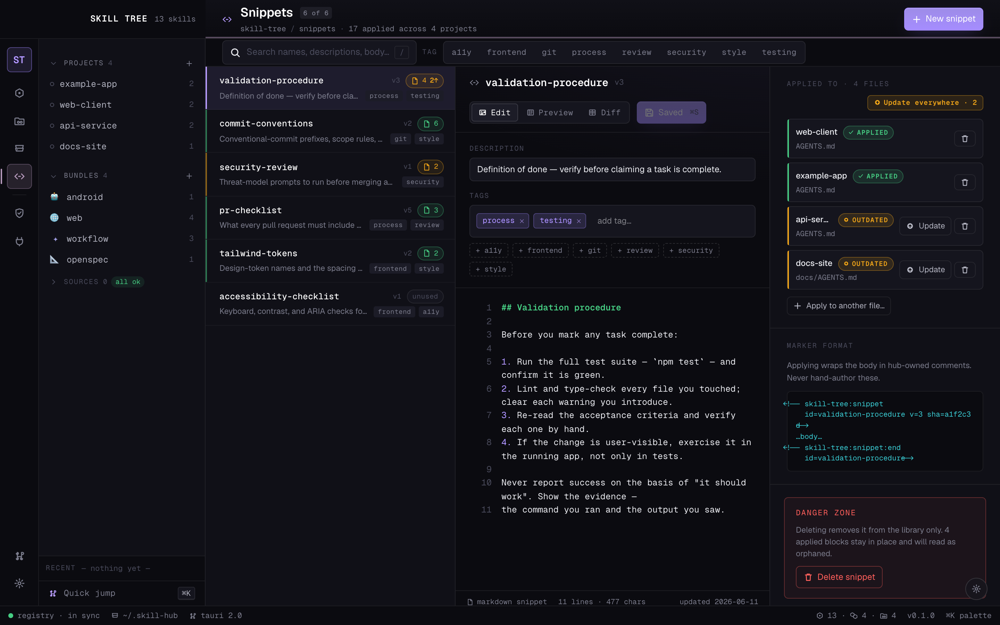

# Skill Tree

[](https://github.com/Ramtoi/skill-tree/actions/workflows/ci.yml)
[](https://github.com/Ramtoi/skill-tree/releases)
[](./LICENSE)

Per-project skills, agent docs, and permissions for your AI coding agents —
Claude Code, Codex, Pi, and opencode.


<sub>Screens shown with sample data.</sub>

Skill scope today is binary: a skill either lives at the user level and loads
into every session, or you copy it into one project's `.claude/skills/`. Neither
matches how skills actually cluster. The set you want for a Next.js frontend —
component conventions, your Tailwind setup, an accessibility checklist — is dead
weight in a Go service, where it costs context and occasionally steers the agent
toward advice that doesn't apply. Push those skills down to the project level
instead and there's no shared source of truth: the same `react-component.md`
gets copied into six repos, and a fix to one is a fix to one.

Skill Tree adds a layer between the two: **bundles**, named reusable sets of
skills you assign to projects. A skill is authored once in a canonical home
(`~/.skill-hub/skills/`) and can be referenced by any number of bundles; a
bundle can be applied to any number of projects. A `frontend` bundle (component
patterns, design-system notes, Playwright helpers) lands on your web repos and
nowhere else; a `rust-cli` bundle carries your error-handling and `clap`
conventions onto exactly the projects that are Rust CLIs. Onboarding a new repo
on a stack you've built before is one assignment, not a directory of
copy-paste. `hub sync` resolves the union of *global bundles ∪ a project's
applied bundles ∪ its directly-enabled skills* and materialises symlinks into
each harness's skills directory — so editing the canonical copy propagates
everywhere it's referenced, and a given session sees only the skills scoped to
that project.

It targets four harnesses today — **Claude Code**, **Codex**, **Pi**, and
**opencode** — each enabled globally or per project. Skill Tree meets each where
it already looks for skills: Codex, Pi, and opencode share a `.agents/skills/`
directory, so turning several on usually writes one set of files rather than a
copy per agent, while Claude Code reads its own `.claude/skills/`. `hub sync`
only touches the harnesses a project actually uses. The desktop app sits on top
of all this — a visual library, a per-project workspace, drag-and-drop bundle
assignment, and a live view of which skills land where.

> Alpha software. Things move around. The CLI and registry format are stable;
> the desktop app is in active development.

## Beyond skills

The same model — one canonical source, applied per project — extends past
skills:

- 📄 **Agent docs** — one canonical root per project (`AGENTS.md`, with a
  derived `CLAUDE.md` for Claude Code), a map of every nested doc, and a
  per-file view of how much context each one pushes into the repo.
- 🧩 **Snippets** — reusable agent-doc instruction blocks you apply across
  projects and update everywhere at once. Bundles, but for the prose your
  agents read rather than the skills they load.
- 🔒 **Permissions** — allow / ask / deny rules and hooks managed globally and
  per project, then written into each harness's own settings format (and kept
  scope-correct so a project file holds only its own rules).

## Screens

<table>
<tr>
<td width="50%"><br><sub><b>Project workspace</b> — equipped skills, colour-coded by direct equip vs. via bundle.</sub></td>
<td width="50%"><br><sub><b>Agent docs</b> — a canonical <code>AGENTS.md</code> root with a derived <code>CLAUDE.md</code>, a nested-doc map, and per-file context budgeting.</sub></td>
</tr>
<tr>
<td><br><sub><b>Bundle manager</b> — group skills and apply them to projects as a unit.</sub></td>
<td><br><sub><b>Skill editor</b> — edit, preview, and see everywhere a skill is equipped.</sub></td>
</tr>
<tr>
<td colspan="2"><br><sub><b>Snippets</b> — reusable agent-doc instruction blocks, with per-project status (applied / modified / outdated / orphaned) and one-command propagation.</sub></td>
</tr>
</table>

## Installing

Skill Tree ships without a skill library — you bring your own. The first-run
bootstrap imports the skills you already have (from `~/.claude/skills/`,
`~/.codex/skills/`, and your project folders), and a curated starter pack is
planned as an optional external source.

### Prebuilt app (macOS)

Each release attaches a built `Skill Tree.app` to its
[GitHub Release](https://github.com/Ramtoi/skill-tree/releases). The build is
**not yet code-signed or notarized**, so macOS Gatekeeper will quarantine it on
first launch. After downloading and unzipping into `/Applications`:

```bash
# Either: right-click the app → Open → Open (once), or clear the quarantine flag:
xattr -dr com.apple.quarantine "/Applications/Skill Tree.app"
```

You still need **Python 3.11+** on PATH for the CLI the app drives.

### From source

macOS is the primary target; Linux is best-effort, Windows untested. You need:

- **Python 3.11+** on PATH
- **Node 20+** and **npm** (for the desktop app)
- **Rust** stable (for the Tauri build)

```bash
git clone https://github.com/Ramtoi/skill-tree.git
cd skill-tree
python3 hub.py bootstrap     # first-run wizard — sets up ~/.skill-hub/
```

Real user data lives in `~/.skill-hub/registry.yaml`; the repo only ships
`registry.example.yaml` as a reference.

To run the desktop app:

```bash
hub app dev                  # hot-reload dev mode (Vite + Tauri)
hub app build --install      # macOS: build and copy into /Applications
hub dashboard                # launch the installed app
```

## Under the hood

- A **YAML registry** (`~/.skill-hub/registry.yaml`) records skills, bundles,
  projects, and per-project harness/skill assignments — the single source of
  truth everything else is derived from.
- **`hub.py`** is a single-file Python CLI that reads and writes the registry,
  materialises symlinks into each harness's skills directory, and handles MCP
  server and permission distribution. Path resolution separates **code home**
  (read-only assets shipped with the install) from **data home**
  (`~/.skill-hub/` — your registry, owned skills, and backups).
- **Skills** are folders: a `SKILL.md` (frontmatter + body) plus any reference
  files.
- A **Tauri 2 + React 19 desktop app** (`app/`) drives the same CLI — every UI
  action maps to one Rust command that shells out, so no business logic lives in
  the app.

For the design story behind the desktop app, see `DESIGN.md`. For the primitive
contracts inside it, see `COMPONENTS.md`. For onboarding to the codebase as a
contributor, see `CLAUDE.md` and `CONTRIBUTING.md`.

## License

Apache-2.0. See [`LICENSE`](./LICENSE) and [`NOTICE`](./NOTICE).
