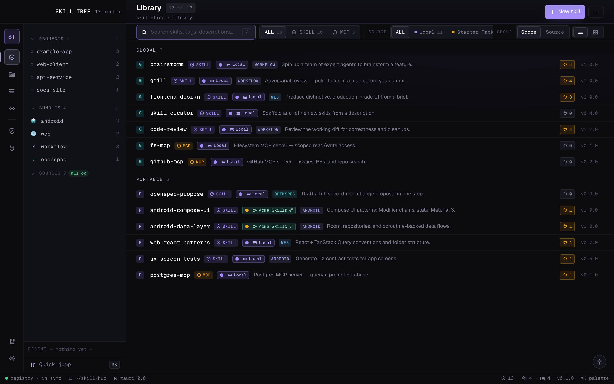
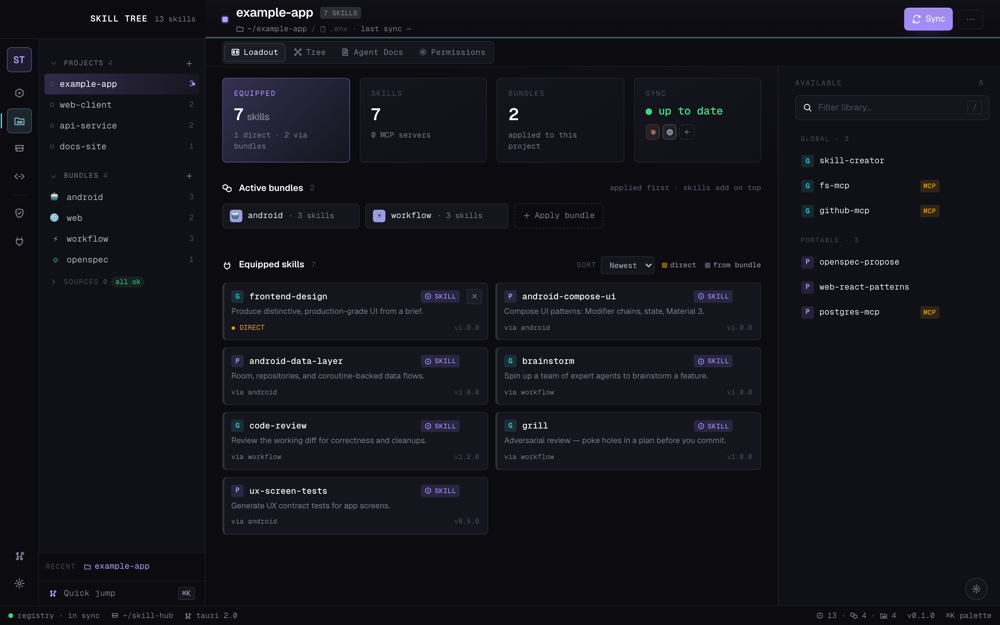
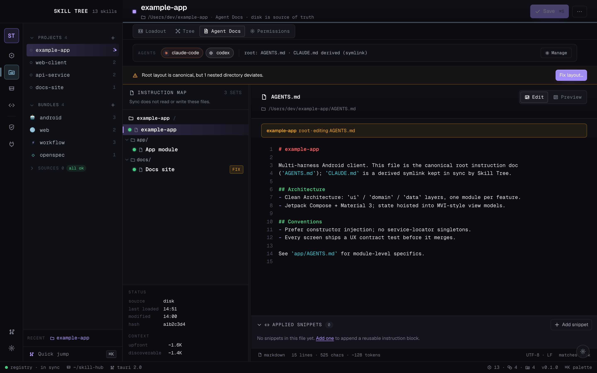
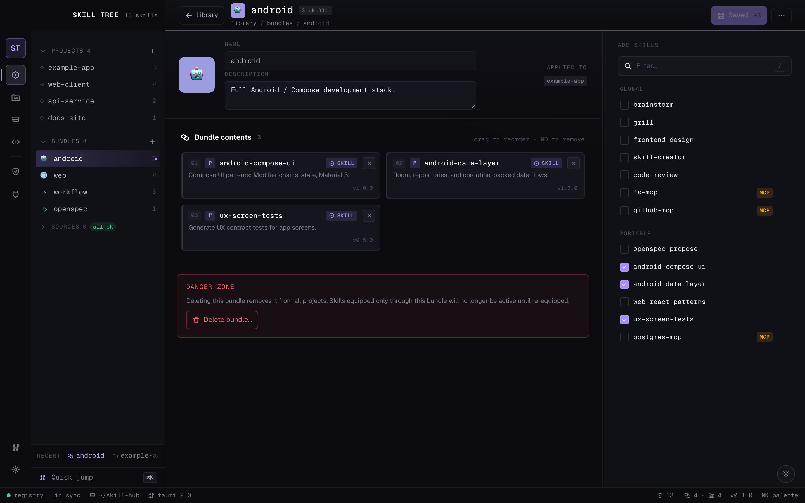
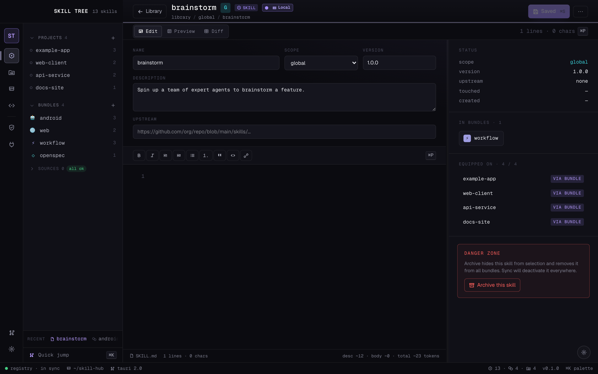

# Skill Tree

[](https://github.com/Ramtoi/skill-tree/actions/workflows/ci.yml)
[](https://github.com/Ramtoi/skill-tree/releases)
[](./LICENSE)

A skill registry and project linker for Claude Code, Codex, Pi, and opencode.



<sub>Screens shown with sample data.</sub>

If you use AI coding agents across more than a couple of projects, you end up
copy-pasting the same skill markdown files into every `.claude/skills/` and
`.agents/skills/` folder, then doing it again every time you tweak one. Skill
Tree is the small piece of glue that fixes that: one canonical home for your
skills, organised into reusable bundles, symlinked out to each project, and
kept in sync as you edit.

It speaks to four agents today — **Claude Code**, **Codex**, **Pi**, and
**opencode** — and treats them as harnesses that can be installed per-project
or globally. The
desktop app gives you a visual library, a per-project workspace, drag-and-drop
bundle assignment, and a live tree view of which skills are landing where.

> Alpha software. Things move around. The CLI and registry format are stable;
> the desktop app is in active development.

## Screens

<table>
<tr>
<td width="50%"><br><sub><b>Project workspace</b> — equipped skills, colour-coded by direct equip vs. via bundle.</sub></td>
<td width="50%"><br><sub><b>Agent docs</b> — a canonical <code>AGENTS.md</code> root with a derived <code>CLAUDE.md</code>, a nested-doc map, and per-file context budgeting.</sub></td>
</tr>
<tr>
<td><br><sub><b>Bundle manager</b> — group skills and apply them to projects as a unit.</sub></td>
<td><br><sub><b>Skill editor</b> — edit, preview, and see everywhere a skill is equipped.</sub></td>
</tr>
</table>

## What's in it

- A YAML registry that records skills, bundles, projects, and per-project
  harness/skill assignments.
- A Python CLI (`hub.py`) that reads/writes the registry, materialises symlinks
  into each project's agent folders, and handles MCP server distribution.
- A Tauri 2 + React 19 desktop app (`app/`) that drives the same CLI under the
  hood — every UI action maps to one Rust command that shells out.

Skill Tree ships without a bundled skill library — you bring your own. The
bootstrap wizard imports the skills you already have (see below), and a curated
starter pack is planned as an optional external source.

## Installing

### Prebuilt app (macOS)

Each release attaches a built `Skill Tree.app` to its
[GitHub Release](https://github.com/Ramtoi/skill-tree/releases). The build is
**not yet code-signed or notarized**, so macOS Gatekeeper will quarantine it on
first launch. After downloading and unzipping into `/Applications`:

```bash
# Either: right-click the app → Open → Open (once), or clear the quarantine flag:
xattr -dr com.apple.quarantine "/Applications/Skill Tree.app"
```

You still need **Python 3.11+** on PATH for the CLI the app drives.

### From source

macOS is the primary target; Linux is best-effort, Windows untested. You need:

- **Python 3.11+** on PATH
- **Node 20+** and **npm** (for the desktop app)
- **Rust** stable (for the Tauri build)

```bash
git clone https://github.com/Ramtoi/skill-tree.git
cd skill-tree
python3 hub.py bootstrap     # first-run wizard — sets up ~/.skill-hub/
```

The bootstrap wizard will offer to import existing skills it finds in
`~/.claude/skills/`, `~/.codex/skills/`, and your project folders. Real user
data lives in `~/.skill-hub/registry.yaml`; the repo only ships
`registry.example.yaml` as a reference.

To run the desktop app:

```bash
hub app dev                  # hot-reload dev mode (Vite + Tauri)
hub app build --install      # macOS: build and copy into /Applications
hub dashboard                # launch the installed app
```

## How it fits together

- `hub.py` is a single-file CLI. Path resolution distinguishes **code home**
  (read-only assets shipped with the install) from **data home**
  (`~/.skill-hub/` — your registry, your owned skills, your backups).
- Skills are folders containing a `SKILL.md` (frontmatter + body) and any
  reference files.
- Bundles group skills. Applying a bundle to a project equips the contained
  skills as a unit; "global" bundles auto-apply everywhere.
- `hub sync` materialises symlinks under each project's
  `.claude/skills/`, `.agents/skills/`, etc., based on the union of global
  bundles, applied bundles, and individually-enabled skills.

For the design story behind the desktop app, see `DESIGN.md`. For the primitive
contracts inside it, see `COMPONENTS.md`. For onboarding to the codebase as a
contributor, see `CLAUDE.md` and `CONTRIBUTING.md`.

## License

Apache-2.0. See [`LICENSE`](./LICENSE) and [`NOTICE`](./NOTICE).
