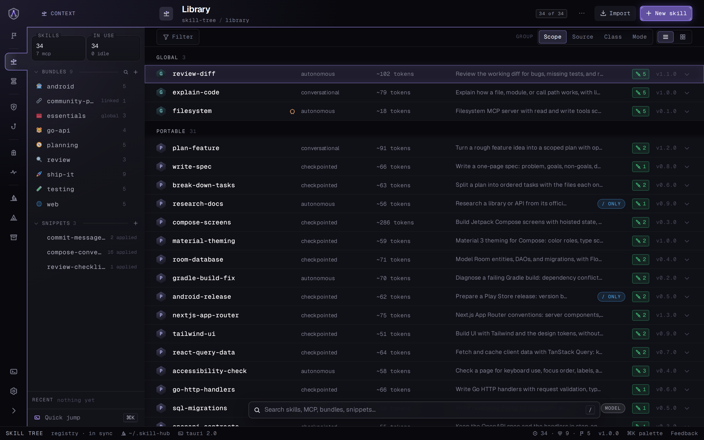
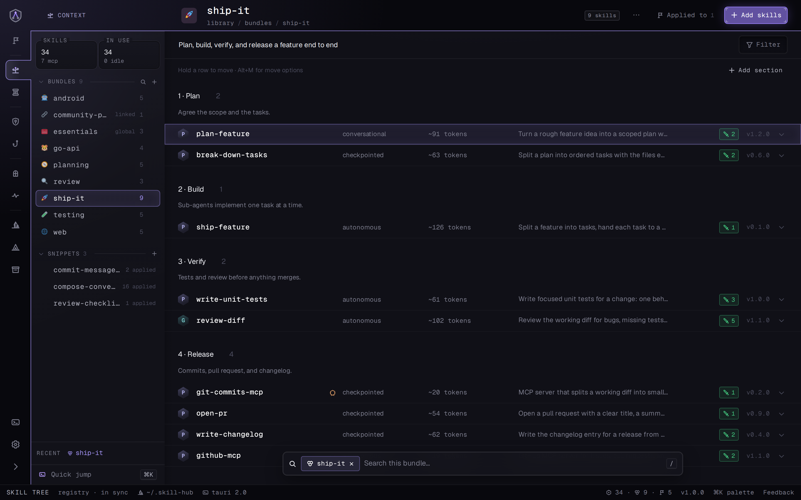
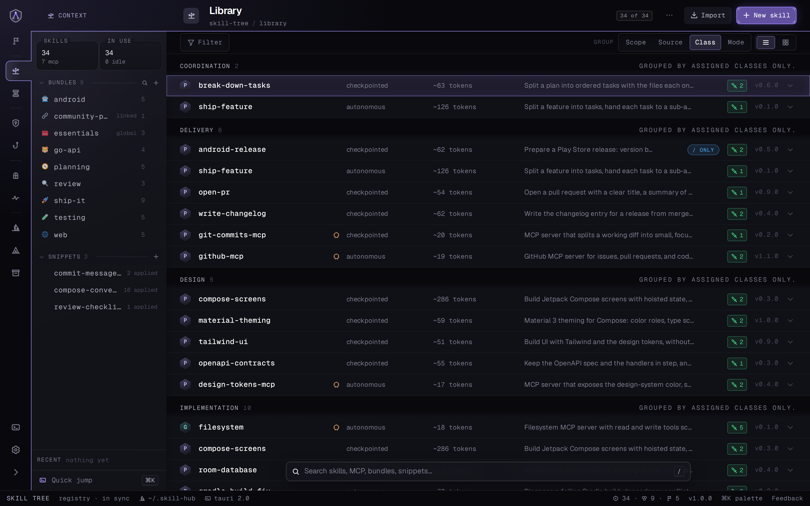
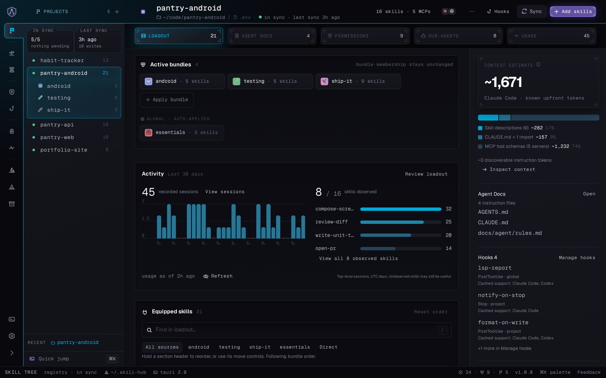
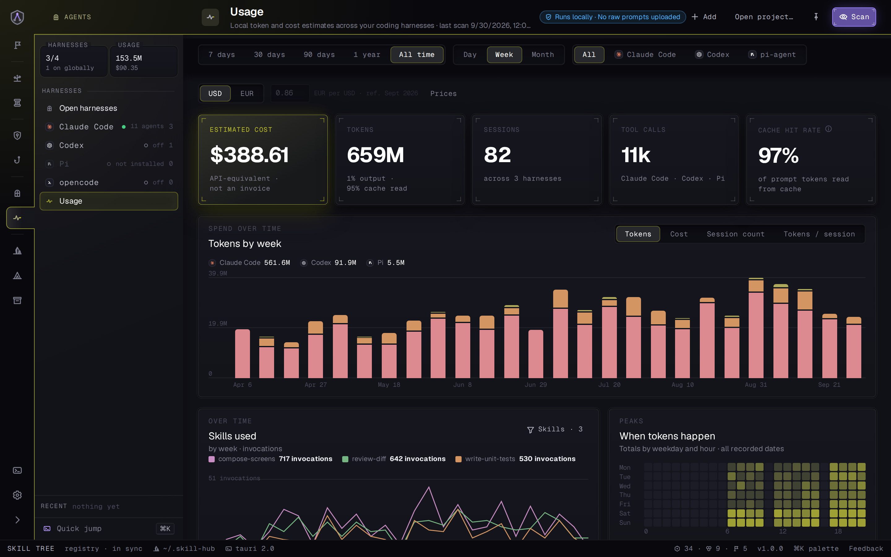
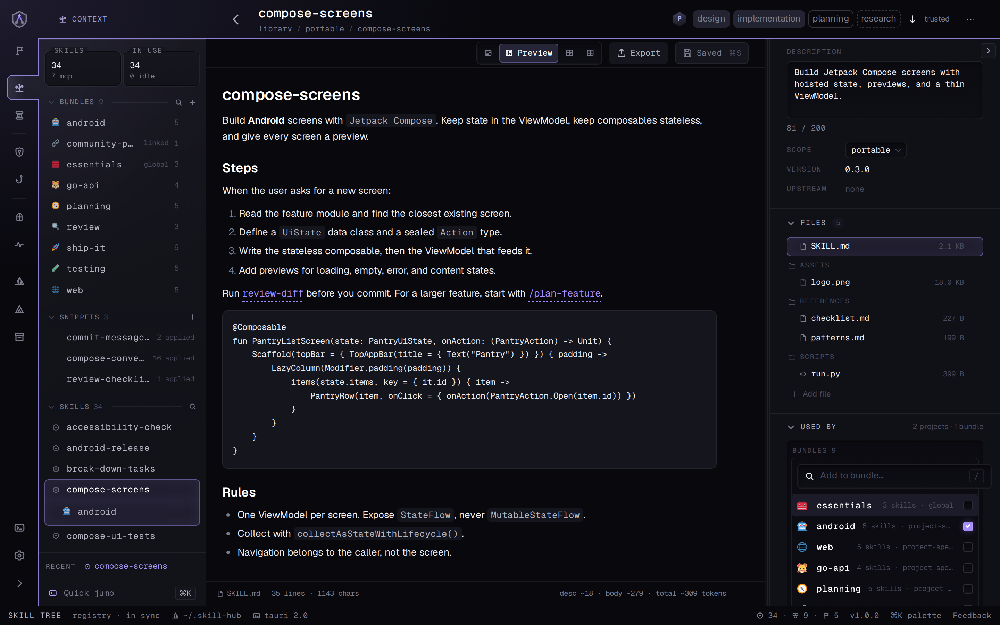
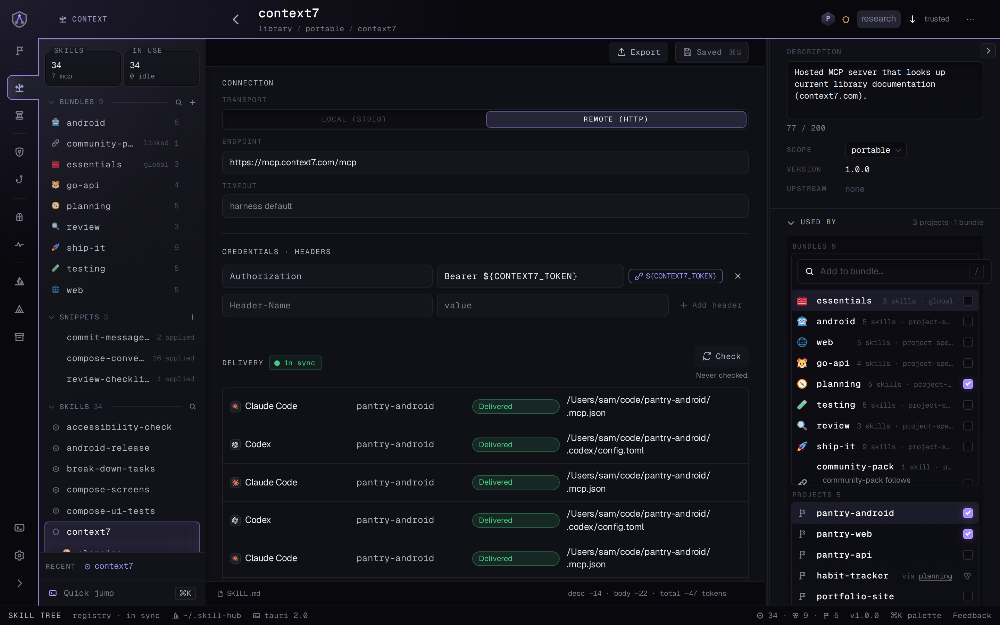
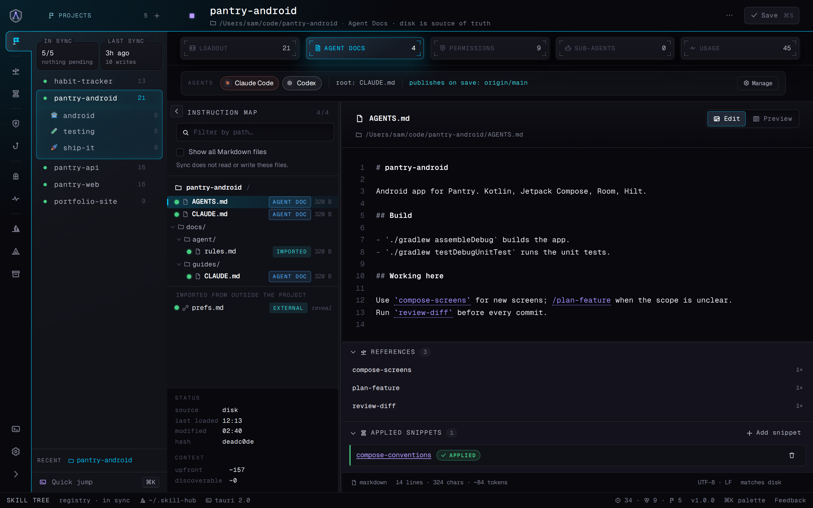
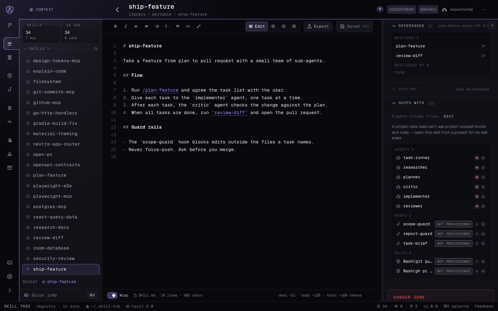

<div align="center">

# Skill Tree

**Give each project the agent skills it needs, and only those.**

One library of skills, MCP servers, and agent docs for Claude Code, Codex, Pi, and opencode.
You choose what each project gets. Skill Tree writes it where each agent looks.

[](https://github.com/Ramtoi/skill-tree/actions/workflows/ci.yml)
[](https://github.com/Ramtoi/skill-tree/releases)
[](./LICENSE)

[Download for macOS](https://github.com/Ramtoi/skill-tree/releases/latest) ·
[Quick start](#quick-start) ·
[Organize](#organize-skills-and-projects) ·
[Why Skill Tree](#why-skill-tree) ·
[Docs](#documentation)

</div>



<sub>All screenshots use sample data.</sub>

## What you get

| | |
|---|---|
| 📚 **One library** | Every skill and MCP server lives in one place, `~/.skill-hub/`. Edit it once and every project that uses it gets the change. |
| 🎒 **Bundles** | Group skills and MCP servers by stack (`android`, `web`), by kind of work (`planning`, `testing`), or as a whole workflow (`ship-it`). Apply a bundle to a project in one step. |
| 🗂️ **Per-project loadouts** | Each project combines the bundles it needs, plus global skills and single skills you add directly. Your Go service does not load your React skills. |
| 🏷️ **Classification** | Tag skills by what they do, what they produce, and how far you trust them. Group and filter the library by those tags. |
| 🔌 **MCP servers** | Add a server once, with secrets as `${VAR}` references. Skill Tree writes it into each agent's own config and checks that it arrived. |
| 🕸️ **Connected skills** | Each skill shows what it references, what it ships with, where it is used, and what it costs in context. See [Skills that know their connections](#skills-that-know-their-connections). |
| 📄 **Agent docs** | See every `AGENTS.md` and `CLAUDE.md` in a project, the skills each one mentions, and what each one costs in context. |
| 🔒 **Permissions and hooks** | Manage allow, ask, and deny rules and hooks globally or per project, in each agent's own format. |
| 📊 **Usage** | See local token and cost estimates per agent, project, session, and skill. The scan runs on your machine and uploads no raw prompts. |
| 🧰 **CLI and MCP** | The desktop app and the `hub` CLI do the same things. A built-in MCP server lets your agent manage its own setup. |

## Quick start

1. **Install the app.** Download `SkillTree-macos.zip` from the
   [latest release](https://github.com/Ramtoi/skill-tree/releases/latest) and
   unzip it into `/Applications`. The build is not code-signed yet, so clear
   the quarantine flag once:

   ```bash
   xattr -dr com.apple.quarantine "/Applications/Skill Tree.app"
   ```

2. **Import what you have.** On first launch, the setup wizard finds the skills
   you already have in `~/.claude/skills/`, `~/.agents/skills/`,
   `~/.codex/skills/`, and Pi's skills folder, and imports them into your
   library.

3. **Add a project.** Open the Projects rail, add a folder, and choose which
   agents it uses. Skills that you wrote inside the project show up as
   detected skills that you can adopt.

4. **Give it skills.** Apply a bundle, or add single skills and MCP servers
   from the library. Mark one as global when every project needs it.

5. **Sync.** Click **Sync**. Skill Tree links the right skills into each
   agent's skills folder for that project and writes the MCP servers into each
   agent's MCP config. Start a new agent session to load them.

The same flow in the CLI (from a source checkout, `hub` is `python3 hub.py`):

```bash
hub bootstrap                                   # first-run wizard: import skills, create ~/.skill-hub/
hub project add pantry-android ~/code/pantry-android
hub bundle new android --skills compose-screens,material-theming,room-database
hub bundle apply android --project pantry-android
hub bundle apply testing --project pantry-android
hub enable review-diff --project pantry-android # one skill, without a bundle
hub sync                                        # write links for every project
```

Skill Tree ships with two read-only built-in skills. `skt-mcp` drives Skill
Tree over MCP. `skill-authoring` helps you write skills that trigger reliably
and stay short. They stay off until you equip them.

## Organize skills and projects

A bundle is a named set of skills and MCP servers. When a skill in the
bundle ships with sub-agents, hooks, or permission rules, those come along
too. How you cut your library into bundles is up to you. Three kinds work
well together:

| Kind | Examples | Use it for |
|---|---|---|
| 🧱 **Stack** | `android`, `web`, `go-api` | What a codebase is made of. Compose conventions go to the Android apps and nowhere else. |
| 🛠️ **Activity** | `planning`, `testing`, `review` | A kind of work that crosses stacks. The same testing skills serve the web app and the API. |
| 🚀 **Suite** | `ship-it` | One workflow from start to end: plan, build, verify, release. |

A project then combines the bundles it needs:

| Project | Bundles |
|---|---|
| `pantry-android` | `android` + `testing` + `ship-it` |
| `pantry-api` | `go-api` + `testing` + `review` |
| `pantry-web` | `web` + `testing` + `review` |
| `habit-tracker` | `android` + `planning` |
| `portfolio-site` | `web` |

Change a bundle once, and every project that uses it gets the change at the
next sync. You can also equip the same bundles on a headless machine, or export them
for a cloud app (claude.ai, ChatGPT). A cloud export takes the skills only;
the upload is a manual step.



More ways to give your library a structure:

- 📑 **Sections.** Split a bundle into ordered sections, each with a short
  line of guidance, so that it reads as a playbook: *1 · Plan*, *2 · Build*,
  *3 · Verify*, *4 · Release*.
- 🌍 **Global bundles.** A global bundle, such as `essentials`, applies to
  every project with no extra step.
- 🔗 **Linked bundles.** A bundle can follow a Git source of skills and
  update when the source does, until you detach it.
- 🎯 **Direct skills.** Add one skill to one project when a whole bundle is
  too much.
- 🏷️ **Classification.** Tag each skill with its kind of work (planning,
  design, build, review, delivery), what it produces, whether it works inline
  or through sub-agents, and how far you trust it. Group the library by
  scope, source, class, or mode.
- 🤖 **Agents per project.** Choose which agents each project uses. Sync
  writes only for those.



## Screens

<table>
<tr>
<td width="50%"><br><sub><b>Project loadout</b>: the bundles and skills a project gets, its context estimate, recent activity, agent docs, and hooks.</sub></td>
<td width="50%"><br><sub><b>Usage</b>: local token and cost estimates across Claude Code, Codex, and Pi, by week, skill, and time of day.</sub></td>
</tr>
<tr>
<td><br><sub><b>Skill editor</b>: edit or preview <code>SKILL.md</code>, manage its files, and see which bundles and projects use it.</sub></td>
<td><br><sub><b>MCP server</b>: connection, credentials as <code>${VAR}</code> references, and delivery status for each agent.</sub></td>
</tr>
<tr>
<td colspan="2"><br><sub><b>Agent docs</b>: every instruction file in the project and the skills that it mentions.</sub></td>
</tr>
</table>

## Skills that know their connections

A skill is rarely alone. It calls other skills, needs a hook or a sub-agent,
and costs context in every session that loads it. Skill Tree keeps track of
these connections so that you can see them before you equip a skill.



- 🔗 **References.** When a skill mentions another skill (`review-diff`,
  `/plan-feature`), Skill Tree links the two. The editor shows what a skill
  mentions and what mentions it. A project loadout warns you when a skill
  refers to one that the project does not have, and
  `hub enable --with-refs` equips both. When you rename a skill, every
  reference to it changes too.
- 🧳 **Ships with.** A skill can declare the sub-agents, hooks, and permission
  rules that it needs. When you equip the skill, Skill Tree offers to install
  them.
  Sync keeps them in step, and they move with the skill through export,
  import, and backup.
- 📏 **Context cost.** Each skill shows its token cost. Each project shows its
  total upfront context: skill descriptions, agent docs, and MCP tool schemas.
- 🗺️ **Where it comes from, where it goes.** Each skill shows its source (local
  or a Git source), its version, and every bundle and project that uses it.
- 🎚️ **Who can start it.** Set a skill to automatic, user-only, or model-only.
  A project can also make a skill user-only for that project alone.
- 📈 **What gets used.** Usage data shows which equipped skills your agents
  actually call, and which ones only take up context.

## Why Skill Tree

Today a skill has two possible scopes. It lives at the user level and loads
into every session, or you copy it into one project's `.claude/skills/`.
Neither matches how skills cluster in real work.

The skills for a Next.js frontend (component conventions, your Tailwind setup,
an accessibility checklist) are dead weight in a Go service. They use context
there, and they can steer the agent toward advice that does not apply. If you
copy them into each project instead, you lose the single source: the same
`react-component.md` lives in six repos, and a fix to one copy fixes only that
copy.

Skill Tree adds a layer between the two scopes: **bundles**. A bundle is a
named, reusable set of skills and MCP servers that you apply to projects.

- You write each skill once, in `~/.skill-hub/skills/`. Any number of bundles
  can include it, and any number of projects can use those bundles.
- A `frontend` bundle goes to your web repos and nowhere else. A `rust-cli`
  bundle takes your error-handling and `clap` conventions to your Rust CLIs.
- A new repo on a stack you know gets its skills in one step, not by copying
  folders.
- Because sync writes links, not copies, an edit to the library copy reaches
  every project that uses it at the next session.

When you sync, Skill Tree computes each project's loadout:

> **global skills** ∪ **the project's bundles** ∪ **skills added to the project directly**

It then links the skills into the skills folder of each agent that the
project uses, and writes the MCP servers into each agent's MCP config. Each
session sees only what its project needs.

The same idea, one source applied per project, also covers the rest of an
agent setup: MCP servers, agent docs, permissions, and hooks.

## How it works

| Agent | Where Skill Tree writes skills |
|---|---|
| Claude Code | `.claude/skills/` |
| Codex | `.agents/skills/` |
| Pi | `.agents/skills/` |
| opencode | `.agents/skills/` |

- **Registry.** `~/.skill-hub/registry.yaml` records your skills, bundles,
  projects, and which agents each project uses. Everything else comes from
  this file. The repo ships `registry.example.yaml` as a reference.
- **Sync.** `hub sync` reads the registry and writes links into each agent's
  folder. Codex, Pi, and opencode share `.agents/skills/`, so several of them
  usually get one set of links. Sync touches only the agents that a project
  uses, and it removes only links that it wrote.
- **Skills** are folders: a `SKILL.md` (frontmatter and body) and any
  reference files or scripts.
- **The desktop app** is Tauri 2 and React 19. Each action in the app calls
  the same Python CLI, so the app holds no business logic of its own.
- **Your data** lives in `~/.skill-hub/`: the registry, your skills, and
  backups. The install holds only read-only code.

## Installing

### macOS app

See [Quick start](#quick-start). The app includes its own Python, so it needs
no system Python. One exception: MCP servers that Skill Tree registers for you
start with `command: "python3"`, so they need **Python 3.9+** on your `PATH`.

### From source

macOS is the main target. Linux works on a best-effort basis. Windows is not
supported. Releases can include an unsigned Windows installer, but it is
untested and has no auto-update.

You need:

- **Python 3.9+** on your `PATH`
- **Node 20+** and **npm** for the desktop app
- **Rust** (stable) for the Tauri build

```bash
git clone https://github.com/Ramtoi/skill-tree.git
cd skill-tree
python3 hub.py bootstrap      # first-run wizard, creates ~/.skill-hub/
```

To run or build the desktop app:

```bash
python3 hub.py app dev              # development mode with hot reload
python3 hub.py app build --install  # macOS: build and copy into /Applications
python3 hub.py dashboard            # open the installed app
```

## Status

Skill Tree 1.0 is the first stable release. The `hub` CLI, the registry
format, and the sync contract follow semantic versioning: a breaking change to
any of them gets a new major version. The desktop app changes faster than the
rest. The [changelog](CHANGELOG.md) lists what is new and the known
limitations of each release.

## Documentation

| Topic | Read |
|---|---|
| Every CLI command | [docs/CLI.md](docs/CLI.md) |
| Writing and adding skills | [docs/ADDING-SKILLS.md](docs/ADDING-SKILLS.md), [docs/SKILL-SCHEMA.md](docs/SKILL-SCHEMA.md) |
| Registry and sync | [docs/REGISTRY.md](docs/REGISTRY.md), [docs/SYNC.md](docs/SYNC.md) |
| Agent docs | [docs/AGENT-DOCS.md](docs/AGENT-DOCS.md) |
| Skill references | [docs/SKILL-REFS.md](docs/SKILL-REFS.md) |
| Permissions, hooks, and sub-agents | [docs/permissions.md](docs/permissions.md), [docs/HOOKS.md](docs/HOOKS.md), [docs/subagents.md](docs/subagents.md) |
| Usage dashboard | [docs/USAGE.md](docs/USAGE.md) |
| Backup and restore | [docs/BACKUP.md](docs/BACKUP.md) |
| Headless machines and cloud apps | [docs/HEADLESS-MACHINES.md](docs/HEADLESS-MACHINES.md), [docs/cloud-targets.md](docs/cloud-targets.md) |
| App feedback | [docs/FEEDBACK.md](docs/FEEDBACK.md) |
| Contributing | [CONTRIBUTING.md](CONTRIBUTING.md), [DESIGN.md](DESIGN.md) |

## License

Apache-2.0. See [`LICENSE`](./LICENSE) and [`NOTICE`](./NOTICE).
